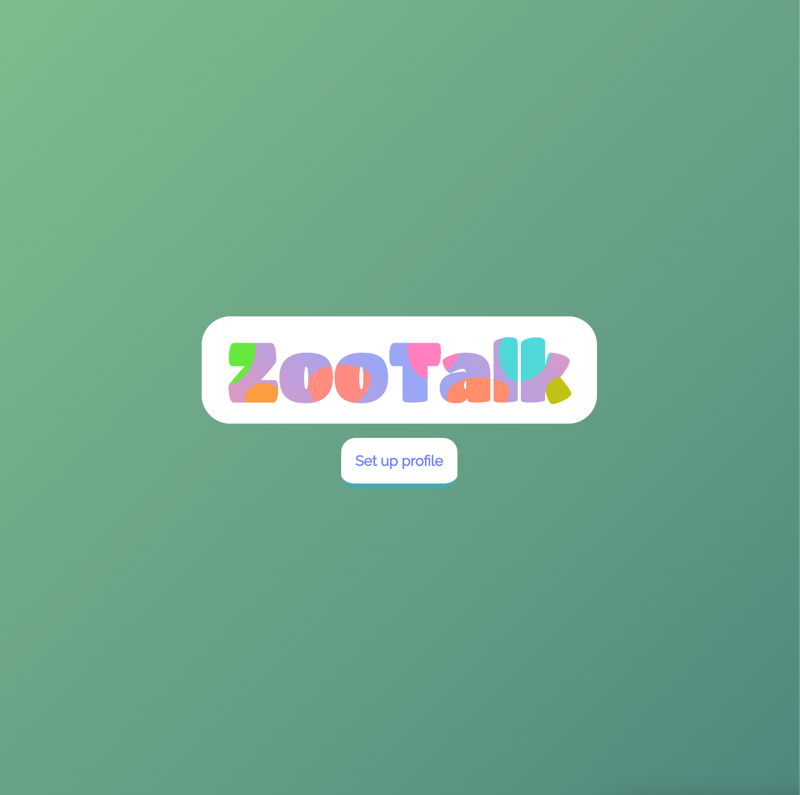
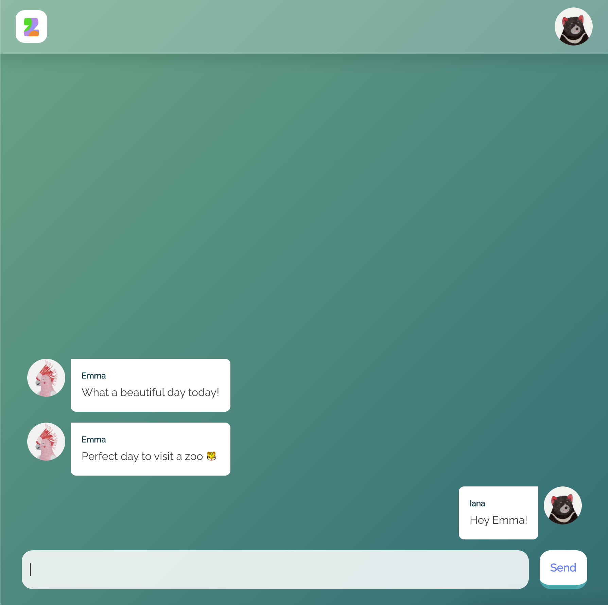

# Zootalk App

A web app built for demonstration of a chat app developed using GraphQL and Apollo.

Demonstration is prepared for Lexicon Digital Tech Guild.

> ⚠️ **Warning**: This is not an example of production-ready application.

</div>
</div>

|              Landing Page              |            Chat View             |
| :------------------------------------: | :------------------------------: |
|  |  |

## Table of contents

- [Design Notes](#design-notes)
- [Development](#development)
  - [Prerequisites](#prerequisites)
  - [Installation](#installation)
- [Building and running the project](#building-and-running-the-project)

## Design Notes

- This project was bootstrapped with [Create React App](https://github.com/facebook/create-react-app).
- `styled-components` library was used to improve code readability and allow for easier migration of the project to `React Native`, if needed.
- The logo is designed and developed by Amli on Codepen. The original Codepen referenced in this project is [here](https://codepen.io/uzcho_/pen/LaPqWJ).

## Development

### Prerequisites

To build and run the project you might need to install the following tools:

- Node - [Installation Instructions](https://nodejs.org/en/download/package-manager/)
- Yarn - [Installation Instructions](https://classic.yarnpkg.com/en/docs/install)
- `zootalk-service` backend (follow the installation requirements specified in the repository)

### Installation

```sh
yarn install
```

## Building and running the project

To build the project use the command below.
It correctly bundles React in production mode and optimizes the build for the best performance. The build is minified and the filenames include the hashes.

See the section about [create-react-app deployment](https://facebook.github.io/create-react-app/docs/deployment) for more information.

```
yarn build
```

To start the app server in the development mode with hot reloading on code changes run the command below. Open [http://localhost:3000](http://localhost:3000) to view it in the browser.

Make sure the backend `zootalk-service` is running locally (on http://localhost:4000 by default).

```
yarn start
```
